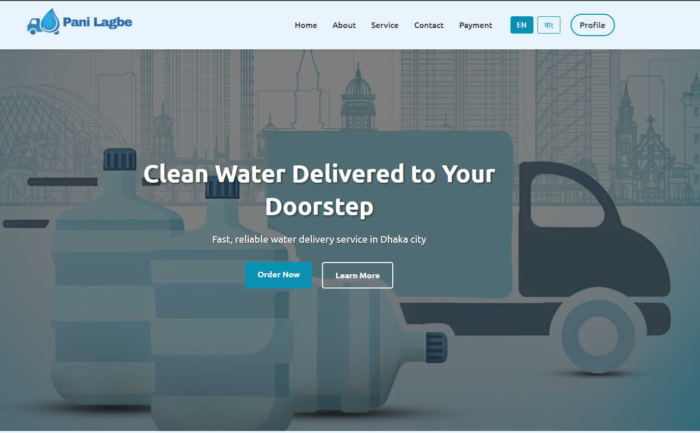
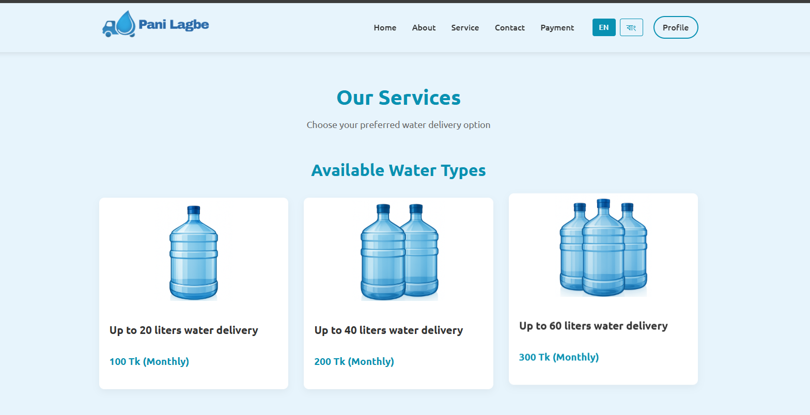
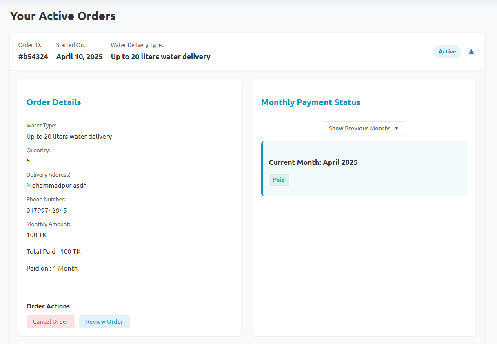
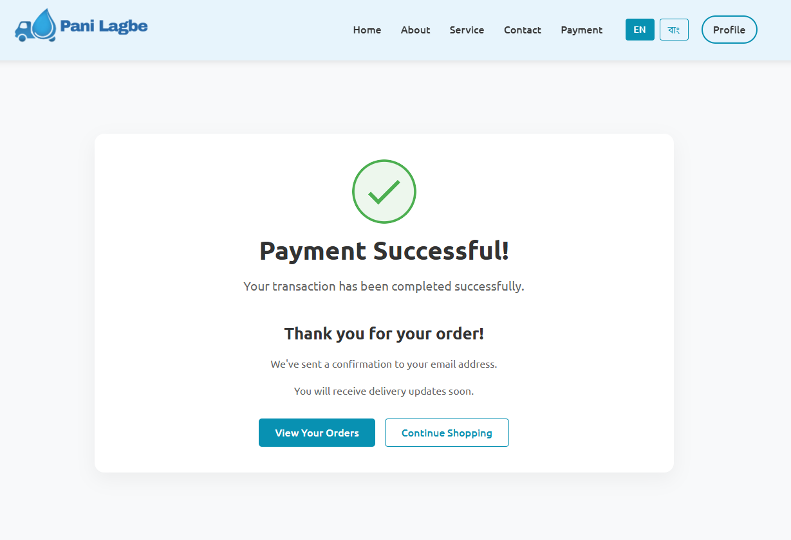

# Pani Lagbe - Water Delivery Service
## Live Demo

Visit my live application: [Pani Lagbe](https://panilagbe.onrender.com/)

The backend API is hosted at: [Pani Lagbe API](https://panilagbe-api.onrender.com/)

> Note: The application is optimized for both desktop and mobile devices. For the best experience, please use the latest version of Chrome, Firefox, or Safari.


<p align="center">
  
</p>

<p align="center">
  <a href="#overview">Overview</a> •
  <a href="#features">Features</a> •
  <a href="#tech-stack">Tech Stack</a> •
  <a href="#installation">Installation</a> •
  <a href="#screenshots">Screenshots</a> •
  <a href="#api-endpoints">API</a> •
  <a href="#contact">Contact</a>
</p>

## Overview

Pani Lagbe is a comprehensive water delivery service platform built with the MERN stack (MongoDB, Express.js, React.js, and Node.js). This application enables users to order water from Dhaka WASA booths for home delivery, manage monthly subscriptions, track payments, and provide service feedback.

## Features

### User Features
- **Multi-language Support**: Complete interface in English and Bengali
- **User Authentication**: Secure registration and login system
- **Water Service Subscription**: Monthly subscription management
- **Online Payments**: Integrated with SSLCommerz, bKash, and Nagad
- **Order Management**: Track delivery status and order history
- **Payment History**: View and manage monthly payments
- **Reviews**: Submit and browse customer reviews

### Technical Features
- **Responsive Design**: Optimized for all device sizes
- **MVC Architecture**: Clean separation of concerns in backend
- **RESTful API**: Well-structured endpoints for all operations
- **JWT Authentication**: Secure routes and user verification
- **Comprehensive Validation**: Form validation on both client and server
- **Error Handling**: Graceful error management throughout the application

## Tech Stack

### Frontend
- React.js with Vite
- React Router for navigation
- CSS Modules for styling
- Axios for API communication

### Backend
- Node.js with Express.js
- MongoDB with Mongoose ODM
- Passport.js with JWT strategy
- bcrypt for password security
- express-validator for request validation
- SSLCommerz payment gateway integration

## Installation

### Prerequisites
- Node.js (v14+)
- MongoDB
- npm or yarn

### Setup Steps

1. **Clone the repository**
   ```bash
   git clone https://github.com/dev-ratul-anjum/panilagbe.git
   cd panilagbe
   ```

2. **Install backend dependencies**
   ```bash
   cd backend
   npm install
   ```

3. **Install frontend dependencies**
   ```bash
   cd frontend
   npm install
   ```

4. **Configure environment variables**
   
   Backend `.env`:
   ```
   MONGODB_URI=your_mongodb_connection_string
   JWT_SECRET=your_jwt_secret
   PORT=your_port
   NODE_ENV=development
   SSLCOMMERZ_STORE_ID=your_store_id
   SSLCOMMERZ_STORE_PASSWORD=your_store_password
   ```

   Frontend `.env`:
   ```
   VITE_BACKEND_URL=your_backend_url
   ```

5. **Start the application**
   
   Backend:
   ```bash
   cd backend
   npm run dev
   ```

   Frontend:
   ```bash
   cd frontend
   npm run dev
   ```

## Project Structure

```
panilagbe/
├── backend/               # Backend code
│   ├── config/            # Configuration files
│   ├── controllers/       # Route controllers
│   ├── middleware/        # Express middleware
│   ├── models/            # Mongoose models
│   ├── routes/            # API routes
│   └── server.js          # Express app
├── frontend/              # Frontend code
│   ├── public/            # Static files
│   ├── src/               # React source files
│   │   ├── assets/        # Images, fonts, etc.
│   │   ├── components/    # Reusable components
│   │   ├── hooks/         # Custom React hooks
│   │   ├── pages/         # Page components
│   │   ├── App.jsx        # Main App component
│   │   └── main.jsx       # Entry point
│   └── vite.config.js     # Vite configuration
└── README.md              # Project documentation
```

## Screenshots

<p align="center">
  
  &nbsp;&nbsp;
  
</p>
<p align="center">
  
  &nbsp;&nbsp;
  
</p>

## API Endpoints

### Authentication
- `POST /api/users/register` - Register new user
- `POST /api/users/login` - User login
- `GET /api/users/me` - Get current user

### Orders
- `GET /api/orders` - Get user orders
- `POST /api/orders` - Create order
- `GET /api/orders/:id` - Get specific order
- `PUT /api/orders/:id` - Update order
- `DELETE /api/orders/:id` - Cancel order

### Payments
- `POST /api/orders/pay` - Process payment
- `GET /api/orders/payment/success` - Payment success callback
- `GET /api/orders/payment/fail` - Payment failure callback
- `GET /api/orders/payment/cancel` - Payment cancellation callback

### Reviews
- `GET /api/reviews` - Get all reviews
- `POST /api/reviews` - Add review
- `GET /api/reviews/:id` - Get specific review

## Contributing

1. Fork the repository
2. Create your feature branch (`git checkout -b feature/amazing-feature`)
3. Commit your changes (`git commit -m 'Add some amazing feature'`)
4. Push to the branch (`git push origin feature/amazing-feature`)
5. Open a Pull Request

## License

This project is licensed under the MIT License.

## Contact

- **Project Link**: [https://github.com/dev-ratul-anjum/panilagbe](https://github.com/dev-ratul-anjum/panilagbe)
- **Website**: [https://panilagbe.onrender.com](https://panilagbe.onrender.com)

## Acknowledgments

- [SSLCommerz](https://www.sslcommerz.com/) for payment gateway
- [React Icons](https://react-icons.github.io/react-icons/) for icon library
- [MongoDB Atlas](https://www.mongodb.com/cloud/atlas) for database hosting
